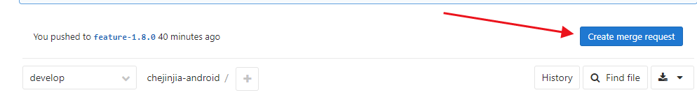
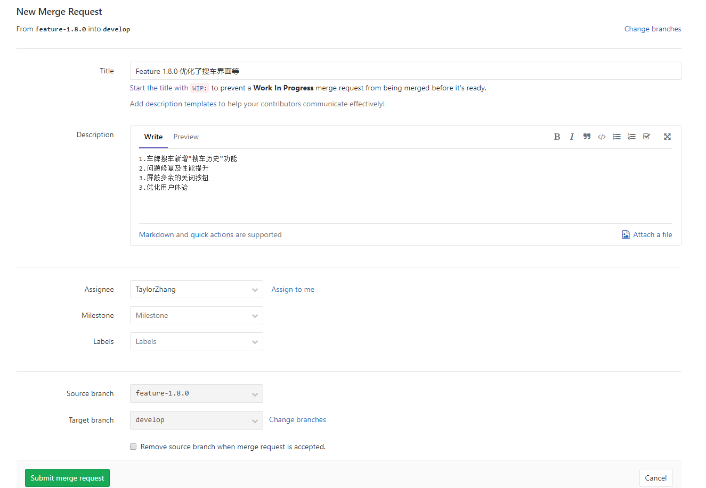
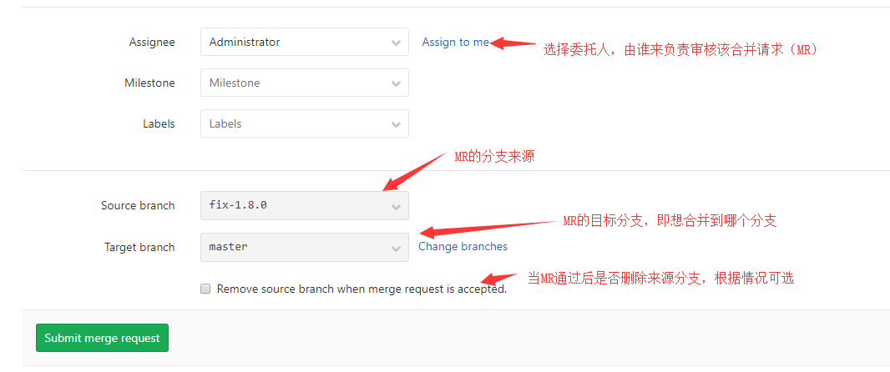
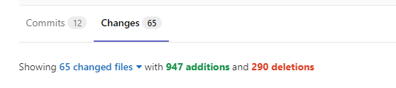
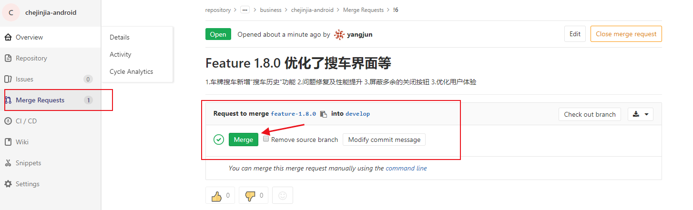
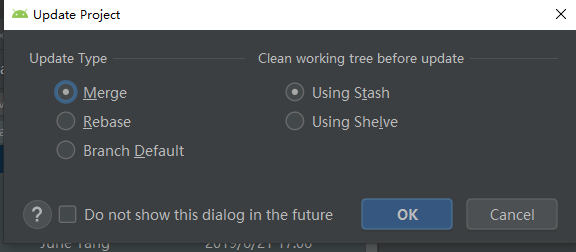

[TOC]

# Git使用规范 Android 版

根据 Git 分支管理策略，结合 Git Flow 分支管理实践，以及 Android 实际开发情况，制定了这个适合 App 项目开发的 Git 使用规范 。

## 一、Git的⼏个理念

### 1. 分支

Git 的 master 分支并不是⼀个特殊分⽀，它与其它分⽀没有任何区别。之所以几乎每⼀个仓库都有 master 分支，是因为 `git init` 命令默认创建它，并且⼤多数⼈都懒得去改动它。

### 2. 分支与合并

在 Git 中分支合并是很平常的事情，在开发过程中要适应经常进行分⽀合并的操作。在Git中，分⽀只是一个指针，并不会进⾏物理拷贝，所以创建分⽀时异常⾼效与易用。

### 3. 完全分布式 

虽然都有⼀个 Git 服务器，即 origin ，实际上它与每个开发人员本地仓库是平等的。 origin 主要⽤于永久保存代码，同时也便于开发人员之间协同工作。但从技术上来说， origin 与开发人员的本地仓库没有什么不同。

## 二、Git分支模型

分⽀模型，是对 Git 运用的⼀种约束，适配于团队的⽇常开发、新功能开发、bug修复；通过该模型以建⽴一套⾏之有效的开发、测试及上线发布流程。同时，分支模型约定所有的开发⼈员的操作规范，建立对应的处理流程，使得软件的开发过程更易于管理。

### 1. master分支

git 的默认分⽀，主分支，不轻易改动，上面的代码为生产环境的最新发布版本。在新版本发布后，需要将新版本代码合并到该分支，并在该分支上打 `tag` 。

| 命名规范 | 分支来源 | 分支目标 | 合并来源 | 合并目标 | 权限 | 应用环境 |
| :------- | :------- | :------- | :------- | :------: | :------: | :------: |
| -        | -        | `develop`<br>`fix-*` | `release-*`<br>`fix-*` | -    | ⽆ Push 权限 | 生产 |

### 2. develop分支

通常创建 git 项⽬的同时就创建 develop ，是开发人员⽤的主要分支，以 master 为分⽀来源。其最新代码代表着开发⼈员为下一个发布版本提交的最新代码。不能代表最新的特性代码，也不代表正在发布的版本代码。

| 命名规范 | 分支来源 | 分支目标                   | 合并来源                              | 合并目标 |     权限     | 应用环境 |
| :------- | :------- | :------------------------- | :------------------------------------ | :------: | :----------: | :------: |
| -        | master   | `feature-*`<br>`release-*` | `feature-*`<br>`release-*`<br>`fix-*` |    -     | ⽆ Push 权限 |    -     |

禁⽌将下列分⽀合并入 develop 分支：

*  新功能未完成的 feature 分⽀；
* 测试环境未通过的 release 分支；
* 问题未修复的 fix 分支。

### 3. feature分⽀

feature 分支，即新功能分支(有时也称之为特性分支)，主要被用于即将开发的或更长期的功能开发。

它有可能被合并到 develop 分支或者被废弃掉。 

| 命名规范                                                   | 分支来源 | 分支目标 | 合并来源 | 合并目标 | 权限 | 应用环境 |
| :--------------------------------------------------------- | :------- | :------- | :------- | :------: | :--: | :------: |
| `feature-AppVersion`<br>`feature-AppVersion-DeveloperName` | develop  | -        | -        | develop  | all  |   开发   |

feature 分支的创建规则取决于需求复杂程度和开发人员数量，需要考虑开发效率、冲突出现的频次和解决冲突需要花费的时间和精力。

如果需求相对简单或者开发人员较少，可以使用一个分支进行开发，命名规则采用 `feature-AppVersion` ，示例：`feature-1.0.0`。

如果需求相对复杂或者开发人员较多，建议每一个开发人员一个分支，命名规则采用 `feature-AppVersion-DeveloperName`，示例：`feature-1.0.0-zhangsan`。

### 4. release分⽀

release 分支专供测试使用，允许我们在发布前，做最后⼀点改动，包括少量BUG的修改、元数据(如版本信息、编译参数等)的修改等。当所有⼯作完成后， develop 分支再将这些修改全部合并回来，开始下⼀个版本的开发⼯作。

| 命名规范             | 分支来源 | 分支目标 | 合并来源 | 合并目标          |   权限    | 应用环境 |
| :------------------- | :------- | :------- | :------- | :---------------- | :-------: | :------: |
| `release-AppVersion` | develop  | -        | -        | develop<br>master | Push 权限 |   测试   |

命名示例：`release-1.0.0`。

###5. release-fix分⽀

release-fix 分⽀⽤于修复当前 release 分⽀的 bug。

release-fix 分⽀可由某开发人员创建，并且推送到 origin，可由多位开发者共同修复各⾃开发代码产⽣的 bug。每次修复完bug，直接打包给测试，测试通过后，发送 MR 请求到 release 分支。

| 命名规范                 | 分支来源             | 分支目标 | 合并来源 | 合并目标             | 权限 | 应用环境  |
| :----------------------- | :------------------- | :------- | :------- | :------------------- | :--: | :-------: |
| `release-fix-AppVersion` | `release-AppVersion` | -        | -        | `release-AppVersion` | all  | 开发/测试 |

命名示例：`release-fix-1.0.0`。

### 6. fix分支

fix分支用于解决生产环境发现的BUG。

当生产环境发现BUG后，基于最新一次发布App的版本号，创建 fix 分支进行BUG修复。

| 命名规范          | 分支来源 | 分支目标 | 合并来源 | 合并目标  | 权限 | 应用环境  |
| :---------------- | :------- | :------- | :------- | :-------- | :--: | :-------: |
| `fix-AppVersionc` | `master` | -        | -        | `develop` | all  | 测试/生产 |

规范命名的 count 为该版本发现

### 7. optimize分支

优化代码分支，如果项目中使用的某个技术已经过时，或者随着技术的提升，感觉之前的代码有更好的实现，**在时间允许的情况下**，可以考虑优化该部分代码。考虑到新代码可能出现BUG，**经过严格测试后**，才允许合并到 develop 分支，否则仅仅作为个人技术练习。

| 命名规范           | 分支来源  | 分支目标 | 合并来源 | 合并目标  | 权限 | 应用环境 |
| :----------------- | :-------- | :------- | :------- | :-------- | :--: | :------: |
| `optimize-content` | `develop` | -        | -        | `develop` | all  |   开发   |

命名规范中的 content 为准备优化的地方，例如：`optimize-layout-layer`。

feature 分支 和 optimize 分支区别：feature 分支靠需求驱动，optimize 分 靠技术驱动。

fix 分支 和 optimize 分支区别：fix分支一定会在下一个版本上线，而 optimize 分支不一定在下一个版本上线。

## 三、Git使用流程

### 1. 创建项目

1. 在 Gitlab 上创建项目，将项目拉取到本地。
2. 创建以下文件：
   * `README.md` ：工程说明；
   * `CHANGELOG.md`：变更说明日志，记录每个版本做的事情，类似于应用市场上发布的版本说明；
   * `.gitignore`：配置不需要 Git 进行管理的文件。
3. 将修改提交到远程，这个时候Git 会默认创建 master 分支。
4. 基于 master 分支创建 develop 分支。

### 2. 新功能开发

1. 基于 develop 分支创建 feature 分支。
2. 按照需求和UI完成开发任务。
3. 联调代码，完成**自测**。
4. 如果本次开发创建了多个 feature分支，将其合并到一个 feature 分支上，如果只是一个 feature 分支，则不进行操作。
5. 拉取 develop 分支上的代码到 feature 分支，如果存在冲突，解决冲突。
6. 提交 MR 到 develop 分支，MR 通过后删除 feature 分支。

### 3. 测试新功能

1. 检查 MR 到 develop 上的代码，确认后，同意 MR。
2. 基于 develop 分支创建 release-version 分支，**修改应用 versionCode 和 versionName**，**更新 `CHANGELOG.md` 文件中的说明日志**。
3. 在 release-version 上打测试环境的安装包，提交给测试人员进行测试。
4. 如果测试人员发现BUG，基于 release 创建 release-fix 分支修复BUG，BUG修复后直接在 release-fix分支打测试环境的安装包，提交给测试人员进行测试。
5. 重复步骤4，直到测试通过。
6. 提交 MR 到 release 分支，MR 通过后删除 release-fix 分支。

### 4. 发布新版本

1. 基于 release 分支打正式包，提交到应用市场。
2. 提交 MR 到 master 分支，同意后，在 master 分支上打对应版本的 tag，tag的命名规则为 v + version，示例：`v1.0.0`。
3. 提交 MR 到 develop 分支，MR 通过后删除 release 分支。

### 5. 修复线上BUG

1. 基于 master 分支，使用最新一次发布App的版本号，创建 fix 分支进行BUG修复。

2. BUG修复后直接在当前分支打测试环境的安装包，提交给测试人员进行测试。

3. 测试未通过，继续修复。

4. 如果需要立即发版，则基于 fix 分支创建 release 分支，**修改应用 versionCode 和 versionName**，**更新 `CHANGELOG.md` 文件中的说明日志**，删除 fix 分支，剩余步骤参考[4. 发布新版本](#4. 发布新版本)完成发版。

   如果不严重，则提交 MR 到 develop 分支，MR 通过后删除 fix 分支。

### 6.优化代码

1. 基于 develop 分支，创建 optimize 分支。
2. 完成优化。
3. 测试优化。
4. 提交 MR 到 develop 分支，MR 通过后删除 optimize 分支。

## 四、提交规范

Git 每次提交代码，都要写 Commit message（提交说明），否则就不允许提交。一般来说，commit message 应该清晰明了，说明本次提交的目的，包括：代码作用的位置、代码变动的类型、简要描述代码的功能。

| 变动类型 | 描述                                                         |
| -------- | ------------------------------------------------------------ |
| feat     | 新功能（feature）                                            |
| fix      | 修复bug                                                      |
| docs     | 文档的变动，注释的变动                                       |
| style    | 代码格式的变动，比如：方法顺序、字段顺序、方法命名、字段命名等。 |
| refactor | 对已上线代码进行优化，不涉及到需求，只是从技术上去优化代码   |
| test     | 测试的变动                                                   |
| chore    | 构建过程、辅助工具、编辑器配置的变动                         |

示例：

```cmake
fix(首页)：修复缓存异常
feat(用户)：新增修改用户头像的功能
```

> 注意：每次提交代码前，应该先执行 pull 拉取服务器最新代码，防止提交的代码有冲突。
>
> 而且如果先创建本地提交，然后在执行更新操作，这样会导致 Git 自动生成一个合并提交，导致提交历史不够简洁。

## 五、MR使用规范

### 1. MR使用流程

本示例基于 Gitlab。

#### 1. 创建MR请求

1.在项目的仓库主页中找到`Create Merge request`



2.填写请求内容

注意Title和内容的的填写规范：可参考[MR注释规范](#2. MR注释规范)，确认**分支来源、目标分支和委托人**不要填写错误。




分支说明：



#### 2. 处理MR请求

Gitlab 会通过邮件通知到委托人，处理 MR。

1.查看 MR 中代码改变了哪些。



2.确认没有问题，通过 MR，合并完成。如果发现有问题，则关闭请求，合并失败，需要请求人修改代码后重新MR.



### 2. MR注释规范

所有的 MR 请求者，需要详细说明提交注释，如下:

| 源分支      | 目标分支                     | 注释Title                                                    | Descrition                        |
| ----------- | ---------------------------- | ------------------------------------------------------------ | --------------------------------- |
| `release`   | `master`<br/>`develop`       | release-version 测试已通过，提交发布<br/>示例：release-1.0.0 测试已通过，提交发布 | -                                 |
| `feature`   | `develop`                    | feature-version 完成所有功能的开发并联调通过，提交测试<br/>示例：feature-1.0.0 完成所有功能的开发并联调通过，提交测试 | -                                 |
| `fix`       | `develop`（线上Bug下次发版） | fix-version 修复了以下bug并测试通过，提交合并fa'bu<br/>示例：fix-1.0.0 修复了以下bug并测试通过，提交合并 | 1. bug1 <br/>2. bug2 <br/>3. bug3 |
| `fix`       | `master`（线上Bug立即发版）  | fix-version 修复了以下bug并测试通过，提交发布<br/>示例：fix-1.0.0 修复了以下bug并测试通过，提交发布 | 1. bug1 <br/>2. bug2 <br/>3. bug3 |
| release-fix | `release`                    | release-fix-version 修复了以下bug并测试通过，提交发布<br/>示例：release-fix-1.0.0 修复了以下bug并测试通过，提交发布 | 1. bug1 <br/>2. bug2 <br/>3. bug3 |

## 六、代码评审

在两个及两个以上开发人员的项目中，应该进行代码评审，检查代码风格和是否有潜在的BUG。

考虑到开发时间，MR时需要做简易 Code Review，项目发布后做详细 Code Review，如果需要调整代码，新建优化分支进行调整，具体流程参考[优化代码](#6.优化代码)

## 七、常用Git命令示例

### 1. 创建分支

这里以在本地创建 feature 分支举例，其他分支创建需要注意是**基于哪个分支创建**，同事还需要注意**分支命名规则**。

```shell
// 切换到 develop 分支
git checkout develop

// 基于 develop 分支创建 feature 分支
git checkout -b feature-1.0.0 

// 将 feature 分支推送到远程
git push origin feature-1.0.0:feature-1.0.0

// 设置本地 feature 分支关联远程 feature 分支
git branch --set-upstream-to=origin/feature-1.0.0 feature-1.0.0
```

### 2. 删除分支

```shell
// 删除本地分支
// 一般删除，如果分支上的代码没有合并，会失败
git branch -d feature-1.0.0 
// 强制删除
git branch -D feature-1.0.0 

// 删除远程分支
git push origin --delete feature-1.0.0
// or
git push orgin :feature-1.0.0 //（origin 和冒号之间是有空格的）
```

### 3. 更新代码

```shell
git pull --no-rebase
```

### 4. 添加Tag

```shell
// tag 一般在 master 分支添加，所以先切换到 master 分支
git checkout master
// 添加 tag
git tag -a v1.0.0 -m 'tag描述，一般来说就是一句话描述新增代码的功能' 
```

## 八、注意事项

### 1. 避免代码冲突

为了尽量避免冲突发生，养成如下开发习惯：

- 编码前先更新
- 提交前先更新
- 修改了公共文件，尽早通知其他成员更新
- 需要提交 MR 到目标分支，先将目标分支的代码拉到当前分支，如果有冲突，先解决冲突再 MR，没有冲突则直接提交MR。
- 最后一条，也是最重要的，团队分工要明确

### 2. 更新代码使用Merge而不是Rebase

这里不使用 rebase，原因是会把当前分支的 commit 放到公共分支的最后面，所以叫变基。就好像你从公共分支又重新拉出来这个分支一样，改变了commit 的实际提交顺序，这样其他从这个公共分支拉出去的人，都需要再 rebase。

#### 1. 使用命令行更新代码

```shell
git pull --no-rebase
```

#### 2. 使用Android Studio更新代码

按下图配置更新选项：



补充：

Update Type 类型：

- Merge：更新时执行合并操作。等价于执行git fetch && git merge或者git pull --no-rebase。
- Rebase：更新时执行rebase操作。等价于执行git fetch && git rebase或者git pull --rebase。
- Branch Default：在.git/config文件中指定不同分支的更新类型。
